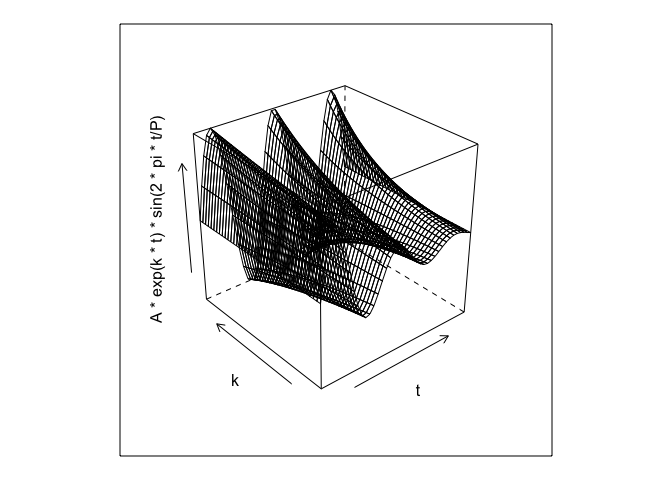
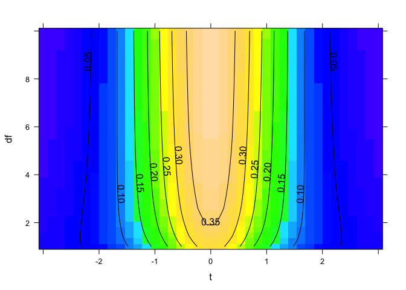
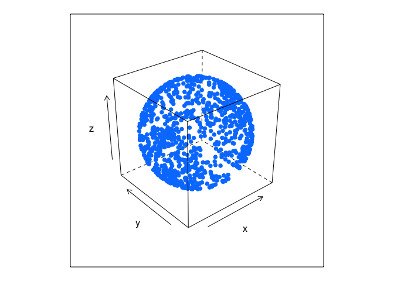

R의 미적분
================

이 기사에서는 R을 사용하여 미적분을 수행하는 방법을 학습합니다. Math는 데이터 과학의 핵심 빌딩 블록 중 하나입니다. 데이터
과학자로서의 기계 학습 작업에서 어떤 일이 벌어지고 있는지 이해하고 싶다면 미적분의 기초에 대한 확실한 이해가 필요합니다.
미적분만으로 많은 데이터 과학을 할 수는 없지만 기계 학습, 알고리즘 및 고급 통계와 같은 데이터 과학의 고급
주제에 필수적입니다.

R과 함께 미적분을 사용하여 시작합시다.

## R의 미적분

``` r
library(mosaic, quietly = TRUE)
```

    ## 
    ## Attaching package: 'dplyr'

    ## The following objects are masked from 'package:stats':
    ## 
    ##     filter, lag

    ## The following objects are masked from 'package:base':
    ## 
    ##     intersect, setdiff, setequal, union

    ## 
    ## Attaching package: 'ggstance'

    ## The following objects are masked from 'package:ggplot2':
    ## 
    ##     geom_errorbarh, GeomErrorbarh

    ## 
    ## New to ggformula?  Try the tutorials: 
    ##  learnr::run_tutorial("introduction", package = "ggformula")
    ##  learnr::run_tutorial("refining", package = "ggformula")

    ## Registered S3 method overwritten by 'mosaic':
    ##   method                           from   
    ##   fortify.SpatialPolygonsDataFrame ggplot2

    ## 
    ## The 'mosaic' package masks several functions from core packages in order to add 
    ## additional features.  The original behavior of these functions should not be affected by this.
    ## 
    ## Note: If you use the Matrix package, be sure to load it BEFORE loading mosaic.

    ## 
    ## Attaching package: 'mosaic'

    ## The following object is masked from 'package:Matrix':
    ## 
    ##     mean

    ## The following object is masked from 'package:ggplot2':
    ## 
    ##     stat

    ## The following objects are masked from 'package:dplyr':
    ## 
    ##     count, do, tally

    ## The following objects are masked from 'package:stats':
    ## 
    ##     binom.test, cor, cor.test, cov, fivenum, IQR, median,
    ##     prop.test, quantile, sd, t.test, var

    ## The following objects are masked from 'package:base':
    ## 
    ##     max, mean, min, prod, range, sample, sum

``` r
f <- makeFun(m * x + b ~ x, m = 3.5, b = 10)
f(x = 2)
```

    ## [1] 17

``` r
g <- makeFun(A * x * cos(pi * x * y) ~ x + y, A = 3)
g
```

    ## function (x, y, A = 3) 
    ## A * x * cos(pi * x * y)

``` r
function (x, y, A = 3)
A * x * cos(pi * x * y)
```

    ## function (x, y, A = 3)
    ## A * x * cos(pi * x * y)

``` r
g(x = 1, y = 2)
```

    ## [1] 3

미적분 함수를 그려
봅시다.

``` r
plotFun(A * exp(k * t) * sin(2 * pi * t/P) ~ t + k, t.lim = range(0, 10), k.lim = range(-0.3,0), A = 10, P = 4)
```

<!-- -->

R에서 다른 기능을 시도해 보겠습니다.

``` r
library(manipulate)
plotFun(A * exp(k * t) * sin(2 * pi * t/P) ~ t + k, t.lim = range(0, 10),k.lim = range(-0.3,0), A = 10, P = 4, surface = TRUE)
```

<!-- -->

R에서 세 번째 기능을 시도해 보겠습니다.

``` r
plotFun(dt(t, df) ~ t + df, t.lim = range(-3,3), df.lim = range(1,10))
```

<!-- -->

## R의 파생 함수

이제 r에서 함수의 파생물을 시도해 보겠습니다.

\#\#R로 해결하기 findZeros() 함수는 사용하기 쉬운 유연한 방법으로 함수의 0을 찾습니다. 구문 plotFun() 및
D()와 매우 유사합니다.

R에서 해결해 보겠습니다.

``` r
findZeros(sin(t) ~ t, t.lim = range(-5, 1))
```

    ##         t
    ## 1 -6.2832
    ## 2 -3.1416
    ## 3  0.0000
    ## 4  3.1416

점에 가장 가까운 몇 개의 0을 찾자.

``` r
findZeros(sin(t) ~ t, nearest = 5, near = 10)
```

    ##         t
    ## 1  3.1416
    ## 2  6.2832
    ## 3  9.4248
    ## 4 12.5664
    ## 5 15.7080

센터와 너비를 통해 범위를 지정하고이를 해결합시다 :

``` r
findZeros(sin(t) ~ t, near = 0, within = 8)
```

    ##         t
    ## 1 -9.4248
    ## 2 -6.2832
    ## 3 -3.1416
    ## 4  0.0000
    ## 5  3.1416
    ## 6  6.2832
    ## 7  9.4248

4 sin (3x) = 2에 대한 해를 풀어 보자.

``` r
solve(4 * sin(3 * x) == 2 ~ x, near = 0, within = 1)
```

    ##        x
    ## 1 0.1746
    ## 2 0.8726

비선형 함수에 대해 Zeros ()를 찾아 보겠습니다.

``` r
findZeros(x * y^2 - 8 ~ x & y, sin(x * y) - 0.5 ~ x & y)
```

    ##              x           y
    ## 1 1.812854e+01 -0.66429890
    ## 2 1.679204e+00 -2.18269600
    ## 3 3.426946e-02 15.27887000
    ## 4 5.791539e+00  1.17529800
    ## 6 9.903873e+00  0.89875740
    ## 7 6.336423e+01 -0.35532270
    ## 9 2.263464e+03  0.05945087

findZeros ()를 다른 비선형 함수에 사용
해보자.

``` r
findZeros(x * y^2 - 8 ~ x & y, sin(x * y) - 0.5 ~ x & y, near = c(x = 20, y = 0),
within = c(x = 5, y = 1))
```

    ##              x            y
    ## 1 3.426946e-02 15.278880000
    ## 2 4.146605e+00 -1.388989000
    ## 3 8.567366e-01  3.055775000
    ## 4 2.585977e+05 -0.005562022
    ## 7 3.426941e-02 15.278880000
    ## 8 4.198009e+01 -0.436539300
    ## 9 3.426947e-02 15.278870000

x, y, z 공간에서 함수 x ^ 2 + y ^ 2 + z ^ 2 - 10의 0을 풀어 봅시다 :

``` r
findZeros(x^2 + y^2 + z^2 - 10 ~ x & y & z, near = 0, within = 4)
```

    ##           x          y         z
    ## 1  1.304852 -1.8665430 2.1939390
    ## 2  1.790244 -1.1696970 2.3296340
    ## 3  1.860647 -0.6356537 2.4765150
    ## 4  2.059848 -1.2606520 2.0415170
    ## 5  2.241668 -1.1765840 1.8950520
    ## 6  2.625885 -0.6004568 1.6566570
    ## 7  2.686683 -0.7627008 1.4832460
    ## 8  2.768462  0.4391361 1.4638240
    ## 9  2.814878  1.1880970 0.8153008
    ## 10 2.843509  0.9829484 0.9737750

표면을 멋지게 보이고 싶다면 우리는 많은 점이 필요합니다. 엄지 손가락의 규칙에 따라 1000 포인트를 시도해 봅시다
:

``` r
s1 <- findZeros(x^2 + y^2 + z^2 - 10 ~ x & y & z, near = 0, within = 10, nearest = 1000)
cloud(z ~ x + y, data = s1, pch = 19)
```

<!-- -->
