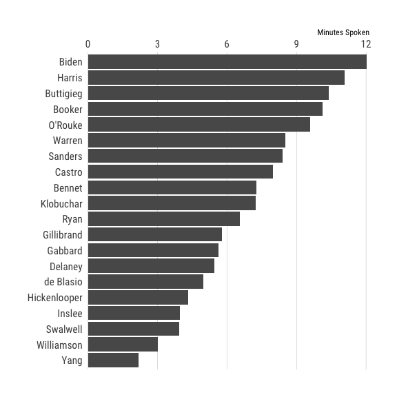
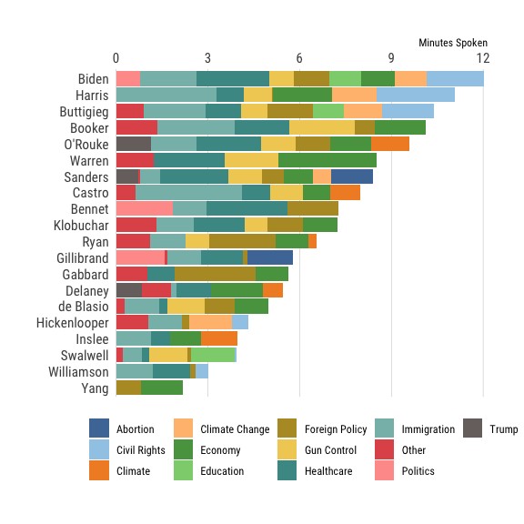
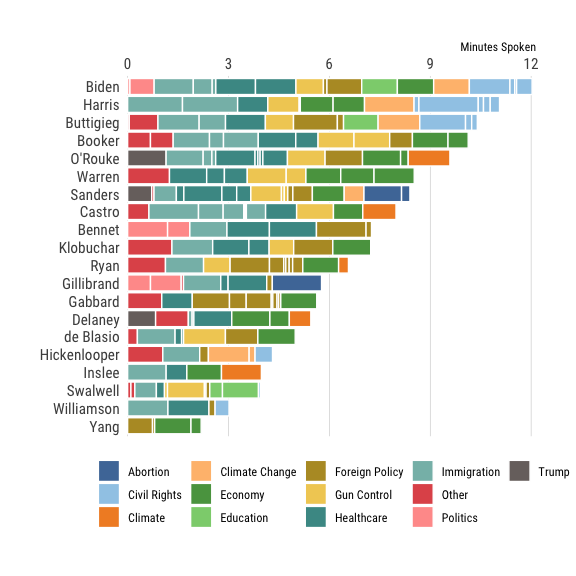
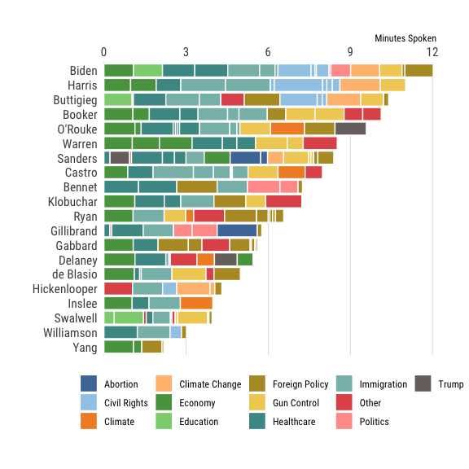
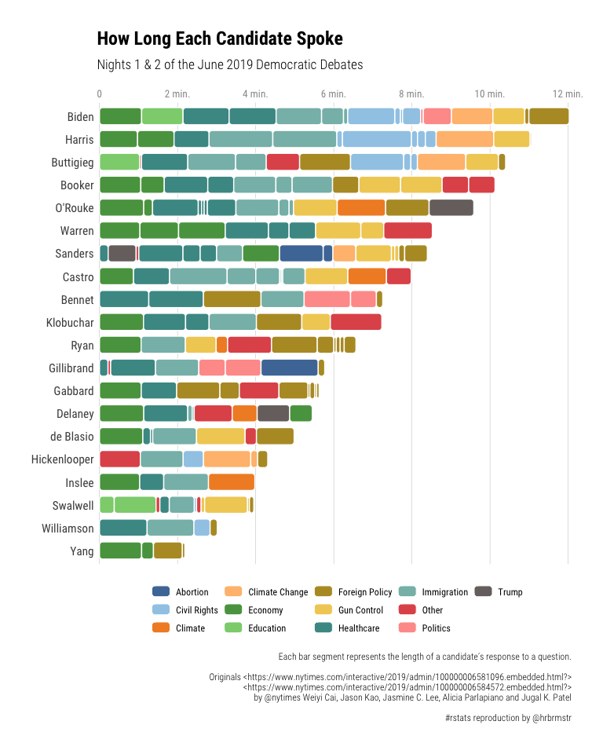
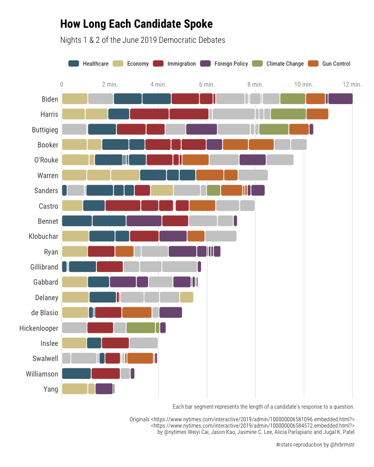

ggchicklet을 사용하여 세그먼트형 막대차트 만들기
================

## 소개

지난 2020 년 선거 시즌에 대한 미국 민주당의 첫 번째 논쟁은 지난 주 POTUS를 위해 후보자를 달리기 때문에 지난 주에 2
박 이상 열렸습니다. 규칙적인 @NYTgraphics의 사람들은 (이 정말 그들이 공연 느슨하게 준비하고, 토론되지 않음) 각
스피커 / 주제별로 시간의 탈리가 깄다 소비를 가져다가 깄다가 수행 된 시간에 주문 둥근 사각형 분할 막대 차트를 만든있는
반 인기있는 껌 / 캔디와 모호한 닮음으로 인해 나는 “chicklet”차트라고 불렀습니다.

매일 자바 스크립트로 작성된 NYTimes 라이브 차트를 볼 수
있습니다.

<https://www.nytimes.com/interactive/2019/admin/100000006581096.embedded.html>
<https://www.nytimes.com/interactive/2019/admin/100000006584572.embedded.html>
이것은 다음 중 하나의 PNG 스냅 샷입니다.

나는 geom\_chicklet()사람들이 그들을 만들 수 있도록 새로운 {ggplot2} 을 만들기에 충분한 chicklet을
좋아 했습니다. 일부 블로그 바이트를 저장하려면
<https://cinc.rud.is/web/packages/ggchicklet/> 에서 패키지를 설치하는 방법을 읽어보십시오 .

## Chicklet 차트 만들기

이후 @NYTimes는 그들도 일종의 데이터가 제공 자신의 차트를 만들기 위해 자바 스크립트를 사용하여 내가 조금
wrangled하고 {ggchicklet} 패키지에 투입 한 어떤합니다 (aforelinked의 URL 모두의 소스를
볼)하기로 결정했습니다. 우리는 기본 바 생산에서 chicklets를 치고 양날에 걸쳐 모든 후보를 비교하는 데
사용할 것입니다.

그동안 @Nytimes 차트 (들)은 많은 양의 정보를 제공, 대부분의 언론 매체는 각 후보가 얻을 수 있었다 얼마나 허튼 소리
시간에 초점을 맞추었다. 우리는 바 차트 나 테이블보다 더 멋진 것을 필요로하지 않습니다 :

``` r
library(hrbrthemes)
library(ggchicklet)
library(tidyverse)
```

    ## ── Attaching packages ────────────────────────────────────────────────────────── tidyverse 1.2.1 ──

    ## ✔ ggplot2 3.2.0     ✔ purrr   0.3.2
    ## ✔ tibble  2.1.3     ✔ dplyr   0.8.3
    ## ✔ tidyr   0.8.3     ✔ stringr 1.4.0
    ## ✔ readr   1.3.1     ✔ forcats 0.4.0

    ## ── Conflicts ───────────────────────────────────────────────────────────── tidyverse_conflicts() ──
    ## ✖ dplyr::filter() masks stats::filter()
    ## ✖ dplyr::lag()    masks stats::lag()

``` r
data("debates2019")

count(debates2019, speaker, wt=elapsed, sort=TRUE) %>%
  mutate(speaker = fct_reorder(speaker, n, sum, .desc=FALSE)) %>%
  mutate(speaker = fct_inorder(speaker) %>% fct_rev()) %>%
  ggplot(aes(speaker,n)) +
  geom_col() +
  scale_y_comma(position = "right") +
  coord_flip() +
  labs(x = NULL, y = "Minutes Spoken") +
  theme_ipsum_rc(grid="X")
```

<!-- -->

동일한 기본보기를보고 싶지만 각 발표자가 각 주제에 소비 한 시간을 포함하면 많은 노력을 기울이지 않고도이를 수행 할 수
있습니다.

``` r
count(debates2019, speaker, topic, wt=elapsed, sort=TRUE) %>%
  mutate(speaker = fct_reorder(speaker, n, sum, .desc=FALSE)) %>%
  ggplot(aes(speaker, n , fill = topic)) +
  geom_col() +
  scale_y_comma(position = "right") +
  ggthemes::scale_fill_tableau("Tableau 20", name = NULL) +
  coord_flip() +
  labs(x = NULL, y = "Minutes Spoken") +
  theme_ipsum_rc(grid="X") +
  theme(legend.position = "bottom")
```

<!-- -->

기본적으로 미학 geom\_col()을 사용하여 fill막대를 그룹화하고 기본 정렬 순서를 사용하여 막대를 그룹화합니다.

또한 count()세그먼트 그룹을 함께 보내지 않고 흰색 막대 윤곽선을 사용하여 구별되게하는 것으로 분할 된보기를 얻을 수
있습니다 .

``` r
debates2019 %>%
  mutate(speaker = fct_reorder(speaker, elapsed, sum, .desc=FALSE)) %>%
  ggplot(aes(speaker, elapsed, fill = topic)) +
  geom_col(color = "white") +
  scale_y_comma(position = "right") +
  ggthemes::scale_fill_tableau("Tableau 20", name = NULL) +
  coord_flip() +
  labs(x = NULL, y = "Minutes Spoken") +
  theme_ipsum_rc(grid="X") +
  theme(legend.position = "bottom")
```

<!-- -->

둥근 직사각형의 미학이 마음에 들었을 때, 논쟁 중에 주제가 발생했을 때 @nytimes 가 세그먼트를 정렬하는 방법을 정말 좋아
했습니다. chicklet 차트의 다른 유형의 경우, 변수를 그룹화 할 필요가 없으므로 시간상의 whime-y 열이 될 수
있습니다. 단지 주문형 특성이있는 무언가를 사용하십시오.

``` r
debates2019 %>%
  mutate(speaker = fct_reorder(speaker, elapsed, sum, .desc=FALSE)) %>%
  ggplot(aes(speaker, elapsed, group = timestamp, fill = topic)) +
  geom_col(color = "white", position = position_stack(reverse = TRUE)) +
  scale_y_comma(position = "right") +
  ggthemes::scale_fill_tableau("Tableau 20", name = NULL) +
  coord_flip() +
  labs(x = NULL, y = "Minutes Spoken") +
  theme_ipsum_rc(grid="X") +
  theme(legend.position = "bottom")
```

<!-- -->

마지막 차트는 심각한 gg-hoops를 뛰어 넘지 않고 @nytimes 룩앤필 을 재현 할 수있는 정도까지 입니다.

나는 둥근 사각형을 숨겨진 기하 구조로 만들어 둥근 모서리 타일을 {statebins} package만들어서
ggplot2::geom\_col()({ggplot2}에 추가 한) 버전을 만드는 것은 매우 간단했습니다. 다음과 같은 몇 가지
주요 차이점이 있습니다 geom\_chicklet().

는 " white있는 chicklet / 세그먼트“스트로크 ( geom\_col()갖는다 NA획) group순서 자동 반전 (
geom\_col()표준 정렬 순서 사용) 반경 설정 unit(3,”px")(필요에 따라 변경) chicklet 전설 geom
(b / c 그들은 바 또는 포인트되지 않습니다) 당신은 아마 행동에서 그것을보고 싶을 것입니다, 그래서 여기 더 이상
adieu입니다 :

``` r
debates2019 %>%
  mutate(speaker = fct_reorder(speaker, elapsed, sum, .desc=FALSE)) %>%
  ggplot(aes(speaker, elapsed, group = timestamp, fill = topic)) +
  geom_chicklet(width = 0.75) +
  scale_y_continuous(
    expand = c(0, 0.0625),
    position = "right",
    breaks = seq(0, 14, 2),
    labels = c(0, sprintf("%d min.", seq(2, 14, 2)))
  ) +
  ggthemes::scale_fill_tableau("Tableau 20", name = NULL) +
  coord_flip() +
  labs(
    x = NULL, y = NULL, fill = NULL,
    title = "How Long Each Candidate Spoke",
    subtitle = "Nights 1 & 2 of the June 2019 Democratic Debates",
    caption = "Each bar segment represents the length of a candidate’s response to a question.\n\nOriginals <https://www.nytimes.com/interactive/2019/admin/100000006581096.embedded.html?>\n<https://www.nytimes.com/interactive/2019/admin/100000006584572.embedded.html?>\nby @nytimes Weiyi Cai, Jason Kao, Jasmine C. Lee, Alicia Parlapiano and Jugal K. Patel\n\n#rstats reproduction by @hrbrmstr"
  ) +
  theme_ipsum_rc(grid="X") +
  theme(axis.text.x = element_text(color = "gray60", size = 10)) +
  theme(legend.position = "bottom")
```

<!-- -->

네, 가까운 얻기 위해 약간의 조정 ggplot2 올렸다 @nytimes (내가, YMMV을 Y 눈금 선을 좋아 FWIW을)하지만
대체 할 다른 많은 일을 할 필요가 없었다 geom\_col()과를 geom\_chicket(). width다른 기하 구조와
마찬가지로 최상의 모양을 얻으려면 자체 플롯의 크기에 따라 세그먼트 값을 사용해야합니다 .

천박하고 용맹 한 독자는 위의 차트에는 모든 항목이 있지만 @nytimes 에는 몇 가지 항목 이 있음을 알 수 있습니다. 우리는
중요 하지 않은 주제를 “기타”카테고리로 그룹화 하고 @nytimes 에서 오마쥬로 사용 된
도난forcats::fct\_other() 값에서 수동으로 채우기 척도를 만들 수 있습니다 .

``` r
debates2019 %>%
  mutate(speaker = fct_reorder(speaker, elapsed, sum, .desc=FALSE)) %>%
  mutate(topic = fct_other(
    topic,
    c("Immigration", "Economy", "Climate Change", "Gun Control", "Healthcare", "Foreign Policy"))
  ) %>%
  ggplot(aes(speaker, elapsed, group = timestamp, fill = topic)) +
  geom_chicklet(width = 0.75) +
  scale_y_continuous(
    expand = c(0, 0.0625),
    position = "right",
    breaks = seq(0, 14, 2),
    labels = c(0, sprintf("%d min.", seq(2, 14, 2)))
  ) +
  scale_fill_manual(
    name = NULL,
    values = c(
      "Immigration" = "#ae4544",
      "Economy" = "#d8cb98",
      "Climate Change" = "#a4ad6f",
      "Gun Control" = "#cc7c3a",
      "Healthcare" = "#436f82",
      "Foreign Policy" = "#7c5981",
      "Other" = "#cccccc"
    ),
    breaks = setdiff(unique(debates2019$topic), "Other")
  ) +
  guides(
    fill = guide_legend(nrow = 1)
  ) +
  coord_flip() +
  labs(
    x = NULL, y = NULL, fill = NULL,
    title = "How Long Each Candidate Spoke",
    subtitle = "Nights 1 & 2 of the June 2019 Democratic Debates",
    caption = "Each bar segment represents the length of a candidate’s response to a question.\n\nOriginals <https://www.nytimes.com/interactive/2019/admin/100000006581096.embedded.html?>\n<https://www.nytimes.com/interactive/2019/admin/100000006584572.embedded.html?>\nby @nytimes Weiyi Cai, Jason Kao, Jasmine C. Lee, Alicia Parlapiano and Jugal K. Patel\n\n#rstats reproduction by @hrbrmstr"
  ) +
  theme_ipsum_rc(grid="X") +
  theme(axis.text.x = element_text(color = "gray60", size = 10)) +
  theme(legend.position = "top")
```

<!-- -->

## 결론

{ggchicklet}을 설치하는 방법과 <https://cinc.rud.is/web/packages/ggchicklet/> 에서
문제 또는 홍보 자료를 제출할 수있는 곳을 찾을 수 있습니다 . 패키지에는 비 네트 (vignette)를 포함한 전체 설명서가
있지만 사용 방법에 대한 도움이 부족한 경우 반드시 문제를 제기하십시오.

패키지를 사용하는 경우 주저하지 말고 다른 사람이 다른 컨텍스트에서 패키지를 사용하는 방법을 볼 수 있도록 주석 또는
Twitter에서 작성 내용을 공유하십시오.
