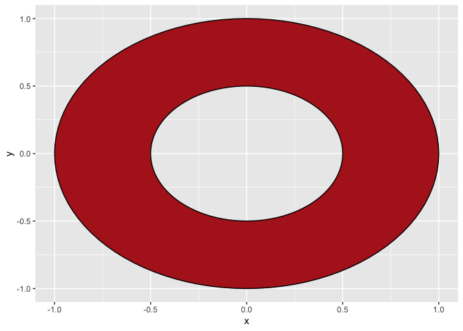
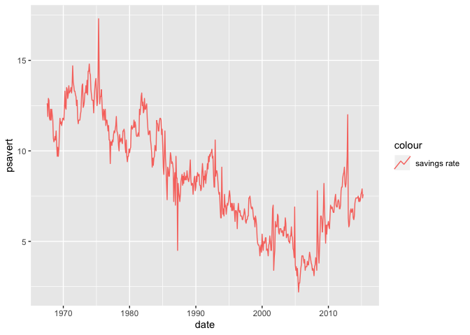
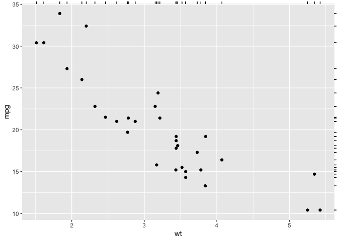
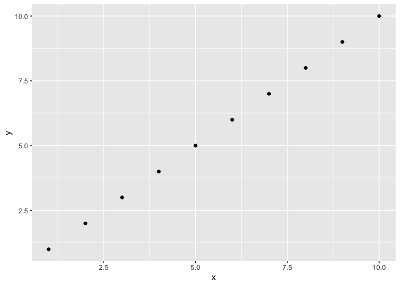
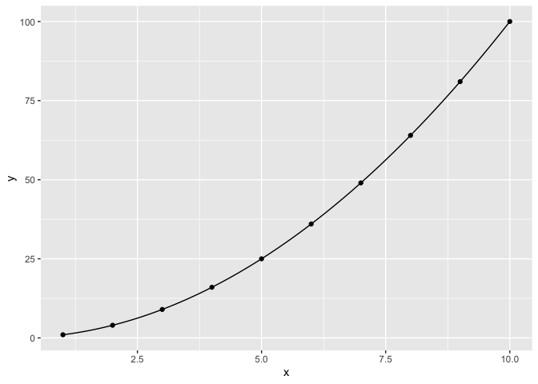
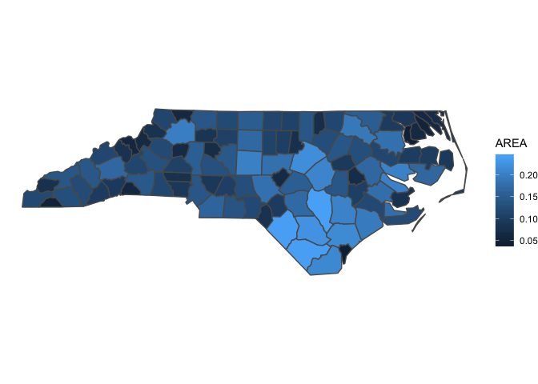

ggplot2 3.2.0 릴리즈
================
THE-R
June 29, 2019

# 테스트 입니다

얼마전 CRAN에 ggplot2 3.2.0 릴리즈 되었습니다 . ggplot2는 The Grammar of Graphics에
기반하여 그래픽을 선언적으로 생성하는 시스템입니다. 데이터를 제공하고 ggplot2 미학요소에 변수를 매핑하는 방법,
사용할 그래픽 프리미티브를 지정하고 세부 사항을 처리합니다.

3.2.0 릴리스는 성능 향상에 중점을 둔 마이너 릴리스이지만 몇 가지 새로운 기능과 다양한 버그 수정이 포함되어 있습니다. 이
릴리스에는 큰 변화가 없지만, 약간의 변경이 작은 부분으로 플롯의 시각적 모양에 영향을 줄 수 있습니다. 또한 확장 패키지
개발자가 고려해야 할 사항이 있지만 일반 사용자에게는 영향을 미치지 않는 몇 가지 변경 사항이 있습니다. 변경 사항에 대한
전체 개요는 [릴리스 정보](https://ggplot2.tidyverse.org/news/index.html)를 참조하십시오.

## 성능 향상

이 릴리스의 대부분은 ggplot2의 속도를 높이기위한 내부 변경과 관련이 있습니다. 이는 모든 플롯의 렌더링 속도에 영향을
미칠것입니다. 그러나 또한 geom\_sf()과 같은 특정한 부분에 초점을 맞추고 있습니다. 이것은 모두 R에서보다 잘
수행되도록하는 큰 노력의 일부이며, 또한 gtable , sf 및 R 자체의 변경 사항을 포함 합니다.

### geom\_sf

대부분의 변경 사항은 일반적인이지만, 특히 geom\_sf()에 주의를 기울였습니다. 이것의 대부분은 geom\_sf()행을
기준으로 행해지는 grobs에 입력 을 어떻게 변환 했는지 에 달려 있습니다. 즉, 10,000 개의
ST\_POINT개체를 플로팅하면 10,000 개의 점을 포함하는 단일 grob 대신 10,000 개의 점 grobs가
생성됩니다. 다른 모든 데이터 유형에서도 마찬가지였습니다. 새 릴리스에서는 ggplot2가 모든 객체를 단일
grob로 압축하려고합니다. 이는 모든 객체가 동일한 유형 인 경우 가능합니다 (MULTI\*유형은 스칼라 유형과 혼합 될 수
있음). 단일 grob로 폴리곤을 포장하는 것은 R 3.6.0 이상에서만 가능하지만 다른 모든 유형은 이전 버전의 R과도
호환됩니다. 데이터에 여러 유형이 혼합되어 있으면 ggplot2는 각 행에 대한 grob를 생성합니다 그러나 이것은 훨씬 덜
빈번한 상황이며 대개 여러 개의 sf 레이어를 만들어 해결할 수 있습니다. sf 데이터를 플로팅 할 때의 다른 큰 성능 병목
현상은 좌표의 정규화입니다. sf가 데이터를 중첩 목록에 저장하면 R의 표준 벡터화가 적용되지 않아 표준 데이터 프레임
형식으로 저장된 데이터를 정규화하는 것과 비교할 때 훨씬 성능이 떨어집니다. sf의 최신 릴리스에는 ggplot2가
사용하는 C에서 구현 된 이러한 작업을위한 최적화 된 기능이 포함되어있어 플로팅 성능이 크게 향상되었습니다.

## 새로운 기능

이번 릴리즈에서 ggplot2는 구멍이있는 폴리곤을 그릴 수 있는 기능을 포함시켰습니다. (R 3.6 이상에만 해당). 새로운
기하 구조를 제공하는 대신 이 기능은 새로운 하위 그룹 미학을 통해
[geom\_polygon()](https://ggplot2.tidyverse.org/reference/geom_polygon.html)에
내장됩니다. 그룹 미학이 데이터의 폴리곤을 분리하는 것처럼 서브 그룹 미학은 각 다각형의 부분을 분리합니다. 처음 발생하는 하위
그룹은 항상 다각형의 외부 링이어야하며 후속 하위 그룹은이 홀 (또는 홀 내의 폴리곤 등)의 홀을 설명합니다. 하위 그룹의
위치에 대해 수행 된 검사는 없으므로 사용자가 외부 링 내부에 있는지 확인하는 것은 사용자의 책임입니다.

``` r
library(ggplot2)
library(tibble)

radians <- seq(0, 2 * pi, length.out = 101)[-1]
circle <- tibble(
  x = c(cos(radians), cos(radians) * 0.5),
  y = c(sin(radians), sin(radians) * 0.5),
  subgroup = rep(c(1, 2), each = 100)
)

ggplot(circle) +
  geom_polygon(
    aes(x = x, y = y, subgroup = subgroup),
    fill = "firebrick",
    colour = "black"
  )
```

<!-- -->

다른 큰 새로운 기능은 모든 기하 구조의 새로운 `key_glyph` 인수를 통해 레이어의 가이드 표현을 수정할 수있는
기능입니다. 기본값은 종종 괜찮지만 다른 시각이 시각화에 도움이되는 경우가 있습니다.

``` r
ggplot(economics, aes(date, psavert, color = "savings rate")) +
  geom_line(key_glyph = "timeseries")
```

<!-- -->

`geom_rug`은 사용자가 러그 라인의 모양을보다 잘 제어 할 수 있도록 다양한 개선 사항을 보았습니다. 러그 선의 길이는
이제 제어 할 수 있으며 플로팅 영역 외부에 배치해야한다고 지정할 수도 있습니다.

``` r
ggplot(mtcars, aes(x = wt, y = mpg)) +
  geom_point() +
  geom_rug(sides = "tr", length = unit(1, "mm"), outside = TRUE) +
  # Need to turn clipping off if rug is outside plot area
  coord_cartesian(clip = "off")
```

<!-- -->

미학은 이제 `NULL`을 반환하는 함수를 받아들이고 미적을 `NULL`로 설정하는 것으로 간주합니다. 이렇게하면 ggplot2로
프로그래밍하기가 더 쉽습니다. 존재하지 않는 변수에서 오류를 포착하여

``` r
df <- data.frame(x = 1:10, y = 1:10)
wrap <- function(...) tryCatch(..., error = function(e) NULL)

ggplot(df, aes(x, y, colour = wrap(no_such_column))) +
  geom_point()
```

<!-- -->

마지막으로, `stat_function()`은 `purrr` 스타일의 람다 함수를 받아들이는 능력을 가졌습니다. 람다 함수를
생성하기위한 수식 표기법의 사용이 널리 보급되었으며, ggplot2도이를 수용합니다.

``` r
df <- data.frame(x = 1:10, y = (1:10)^2)
ggplot(df, aes(x, y)) +
  geom_point() +
  stat_function(fun = ~ .x^2)
```

<!-- -->

## 사소한 수정 및 개선

`coord_sf` 그리드 선을 그리는 방법과 관련하여 다른 좌표와 동일하게 작동합니다. 이는 그리드의 미학이 다른 좌표계의
미학과 일치하며 테마 시스템을 통해 끌 수 있음을 의미합니다. 이 변경 이전 geom\_sf()의 기본 그리드 선이
약간 두꺼운 경우 사용하면 약간의 시각적 변화가 나타날 수 coord\_sf()있습니다. `coord_sf`는 그리드선
그리기와 관련하여 다른 좌표와 동일하게 작동합니다. 이는 그리드의 미학이 다른 좌표계의 미학과 일치하며 테마 시스템을 통해
끌 수 있음을 의미합니다. `geom_sf()`를 사용하면 약간의 시각적 인 변화가있을 수 있습니다. 변경하기 전에 기본 격자
선이 `coord_sf()`에서 약간 두껍습니다.

``` r
library(sf)
```

    ## Linking to GEOS 3.6.1, GDAL 2.1.3, PROJ 4.9.3

``` r
#> Linking to GEOS 3.6.1, GDAL 2.1.3, PROJ 4.9.3

nc <- st_read(system.file("gpkg/nc.gpkg", package = "sf"), quiet = TRUE)

ggplot(nc) +
  geom_sf(data = nc, aes(fill = AREA)) +
  theme_void()
```

<!-- -->

축척 이름이 복잡한 심미적 표현 (예 : `aes (x = a + b)`)을 기반으로하는 경우 저울 자동 이름 지정이 수정되어 더
이상 백틱이 포함되지 않습니다. 다시 말하면 이것은 플롯의 시각적 외관에 약간의 변화를 가져올 수 있지만 매우 표면적 인
수준에서만 발생할 수 있습니다.
