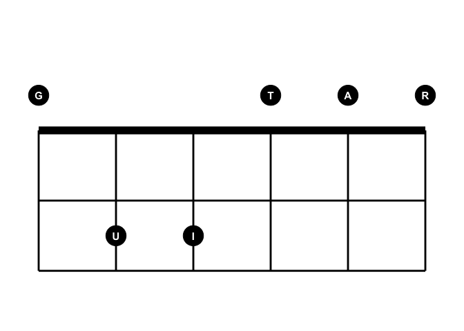
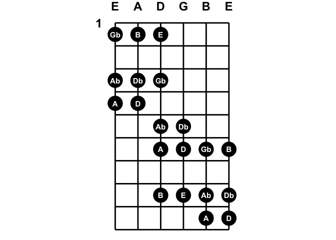
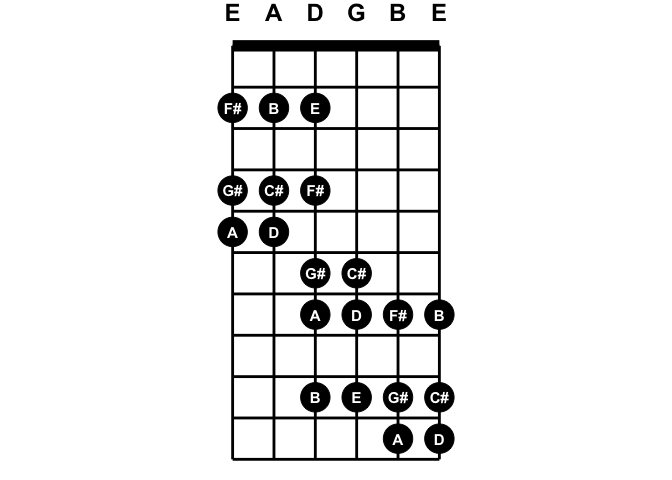
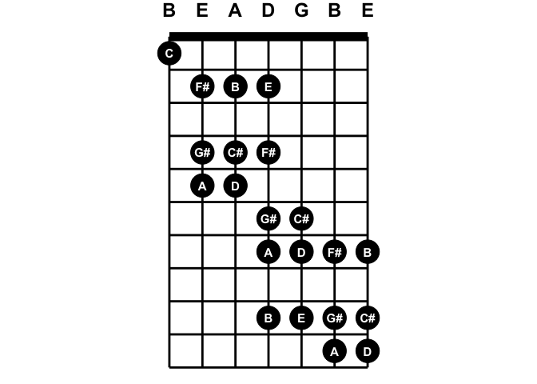
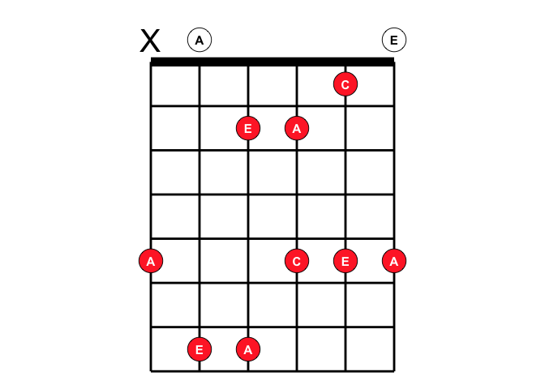
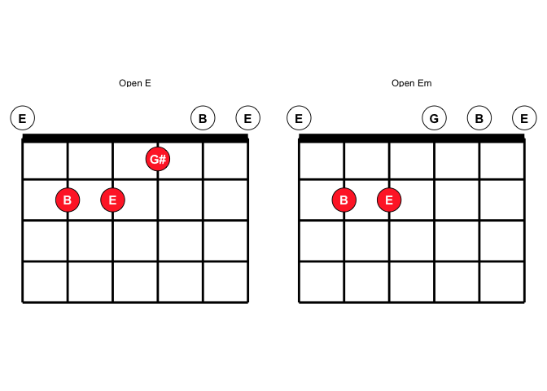
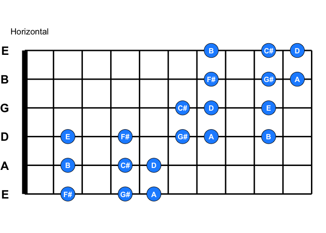
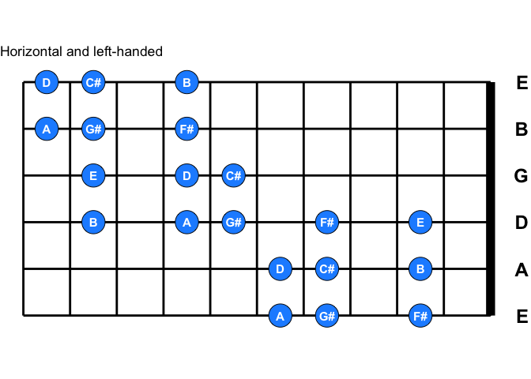

tabr 활용 플레시 보드 다이어그램 플롯
================

## 소개

Tabr의 음악 시각화는 LilyPond를 활용하여 tablature를 만드는 데 초점을 맞추지 만 LilyPond를 포함 할
필요없이 ggplot을 사용하여 일부 다이어그램을 R에서 직접 그릴 수 있습니다. fretboard\_plot 함수는
LilyPond 악보 파이프 라인과 독립적 인 독립 실행 형 fretboard 다이어그램을 R로 만듭니다.

fretboard\_plot은 문자열 번호와 숫자에 대해 벡터 입력을 사용하고 요소를 조합하여 플롯 보드 다이어그램을 생성하는
매우 특수화된 기능입니다. fretboard\_plot은 개발 기능이며 제공되는 인터페이스와 인수가 변경 될 수 있습니다.

음표는 일반적으로 큰 원을 사용하여 다이어그램에 표시됩니다.

``` r
library(tabr)
```

``` r
fretboard_plot(string = 6:1, fret = c(0, 2, 2, 0, 0, 0))
```

<!-- -->

## 라벨 및 튜닝

음표에 라벨을 붙일 수 있습니다. 레이블은 문자열 및 프렛번호에 해당하는 임의의 벡터가 될 수 있습니다. 예를 들어, 코드 또는
음계를 연주하는 데 사용되는 핑거링으로 각 원에 레이블을 지정할 수
있습니다.

``` r
fretboard_plot(6:1, c(0, 2, 2, 0, 0, 0), c("G", "U", "I", "T", "A", "R"))
```

<!-- -->

labels = “notes”를 설정하면 모든 포인트에 음표 이름을 지정하는 특수 설정입니다. 이는 튜닝 인수와 함께 문자열 및
프렛 번호를 제공하면 기타 목에있는 음에 대한 전체 정보를 제공하기 때문에 자동으로 수행 할 수 있습니다.
fretboard\_plot은 내부적으로 이것을 바꿉니다. 즉, 사용자가 설정 한 임의의 튜닝에 상관없이 자동으로 작동합니다.
다음은 튜닝을 표시하는 예제입니다.

``` r
string <- c(6, 6, 6, 5, 5, 5, 4, 4, 4, 4, 4, 3, 3, 3, 2, 2, 2, 1, 1, 1)
fret <- c(2, 4, 5, 2, 4, 5, 2, 4, 6, 7, 9, 6, 7, 9, 7, 9, 10, 7, 9, 10)
fretboard_plot(string, fret, "notes", show_tuning = TRUE)
```

<!-- -->

sharps 나 flats와 같은 labels = “notes”가 키를 특정 키로 설정하거나 단순히 날카 롭거나 편평하게 설정하여
우연히 표시되는 방법. 여기서 F의 키에는 이전 다이어그램의 레이블을 변경하는 플랫이 포함되어 있습니다.

``` r
fretboard_plot(string, fret, "notes", show_tuning = TRUE, key = "f")
```

<!-- -->

## 제한

X와 Y 한계는 악기 현의 수와 프렛의 스팬으로 표현됩니다. fret에서 파생 된 fret 범위를 재정의 할 수
있습니다.

``` r
fretboard_plot(string, fret, "notes", fret_range = c(0, 10), show_tuning = TRUE)
```

<!-- -->

계기가 가지고있는 현의 수는 튜닝에서 파생되었으며 이는 플렛 보드 다이어그램의 가능성을 더욱 일반화합니다. 튜닝은 이제 7 현
기타를 지정합니다. 문자열 7에 하나의 노트가 추가되었습니다.

``` r
tuning <- "b1 e2 a2 d3 g3 b3 e4"
fretboard_plot(c(7, string), c(1, fret), "notes", fret_range = c(0, 10), 
               tuning = tuning, show_tuning = TRUE)
```

<!-- -->

## 색상 및 패싯

점 (원)에는 테두리와 채우기 색이있을 수 있습니다. 라벨은 별도로도 착색 될 수 있습니다. 이러한 인수는 벡터화 될 수
있습니다. 열려있는 Am 코드에는 실제로 열린 여섯 번째 문자열이 없습니다. 음소거 되었습니다. 표기 할 곳을
지정하기 위해 여전히 0이 주어 지지만, 음소거 인수는이 항목이 음소거됨을 나타내는 논리 벡터와 함께 제공됩니다.

``` r
am_frets <- c(c(0, 0, 2, 2, 1, 0), c(5, 7, 7, 5, 5, 5))
am_strings <- c(6:1, 6:1)
mute <- c(TRUE, rep(FALSE, 11))

# colors
idx <- c(2, 2, 1, 1, 1, 2, rep(1, 6))
lab_col <- c("white", "black")[idx]
pt_fill <- c("firebrick1", "white")[idx]

fretboard_plot(am_strings, am_frets, "notes", mute, 
               label_color = lab_col, point_fill = pt_fill)
```

<!-- -->

그룹은 또한 패 시팅에 사용될 수 있습니다. 그러나 패싯은 여전히 문제가되는 기능입니다. 서로 다른 다이어그램이 유사한 프렛을
스패닝하는 경우에 충분할 수 있습니다. 음소거 된 음표의 존재는 또한 패 시팅 할 때 문제를 일으킬 수 있습니다.
fretboard\_plot은 단일 패널 플롯에 가장 적합합니다. 이 함수는 ggplot 객체를 반환하기 때문에 항상 플롯 내에서
패싯을 사용하지 않고 별도의 플롯으로 만들고 격자 레이아웃으로 정렬 할 수 있습니다.

`fretboard_plot`은 tabr 전체에서 사용되는 것과 같은 문자 입력을 허용합니다.

``` r
f <- "0 2 2 1 0 0 0 2 2 0 0 0"
s <- c(6:1, 6:1)
grp <- rep(c("Open E", "Open Em"), each = 6)

# colors
idx <- c(2, 1, 1, 1, 2, 2, 2, 1, 1, 2, 2, 2)
lab_col <- c("white", "black")[idx]
pt_fill <- c("firebrick1", "white")[idx]

fretboard_plot(s, f, "notes", group = grp, fret_range = c(0, 4),
               label_color = lab_col, point_fill = pt_fill)
```

<!-- -->

## 방향

방향과 손을 바꿀 수도 있습니다. 다이어그램은 수직 또는 수평뿐만 아니라 왼손잡이 또는 오른 손잡이 일 수 있습니다.

여기서 제목은 ggtitle을 사용하여 ggplot 객체에 추가됩니다. 물론 fretboard\_plot에 의해 반환 된
ggplot 객체에 추가 할 수 있지만 추가 할 수있는 항목이 제한되어 있으므로 fretboard\_plot이 이미 지정한
레이어의 속성을 무시하지 않도록주의해야합니다.

``` r
library(ggplot2)
fretboard_plot(string, fret, "notes", label_color = "white", point_fill = "dodgerblue",
               fret_range = c(0, 10), show_tuning = TRUE, horizontal = TRUE) +
  ggtitle("Horizontal")
```

<!-- -->

``` r
fretboard_plot(string, fret, "notes", label_color = "white", point_fill = "dodgerblue",
               fret_range = c(0, 10), show_tuning = TRUE, horizontal = TRUE, left_handed = TRUE) +
  ggtitle("Horizontal and left-handed")
```

<!-- -->

참조: [Fretboard diagram
plots](https://leonawicz.github.io/tabr/articles/tabr-fretboard.html)
